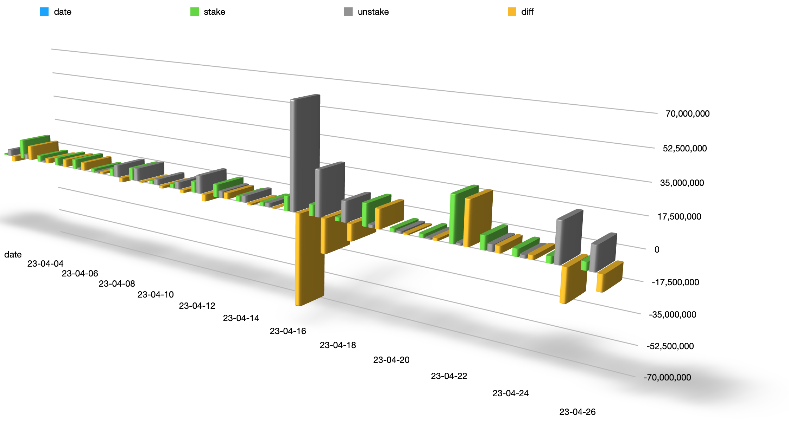
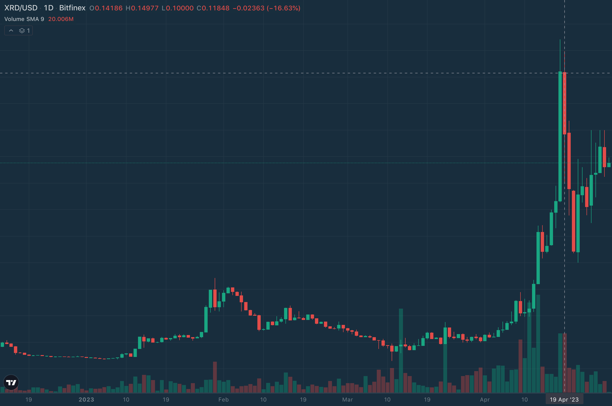

# 为什么需要快速赎回？

以下数据是4月以来的一些Stake数据：

| date     | stake    | unstake  | diff      |
| -------- | -------- | -------- | --------- |
| 23-04-03 |   849240 |  4338934 |  -3489694 |
| 23-04-04 | 12726334 |  3212903 |   9513431 |
| 23-04-05 |  4139103 |   889948 |   3249155 |
| 23-04-06 |  5069262 |   132282 |   4936980 |
| 23-04-07 |  6251590 |  1022629 |   5228961 |
| 23-04-08 |  2421060 |  1064519 |   1356541 |
| 23-04-09 |  4895439 |  7717707 |  -2822268 |
| 23-04-10 |  7720409 |  8161243 |   -440834 |
| 23-04-11 |  2035399 |  3607290 |  -1571891 |
| 23-04-12 |  2621950 |  4370982 |  -1749032 |
| 23-04-13 |  6880948 | 11162750 |  -4281802 |
| 23-04-14 |  7695243 |  4026007 |   3669236 |
| 23-04-15 |  3127180 |  4145977 |  -1018797 |
| 23-04-16 |  2325388 |  2453864 |   -128476 |
| 23-04-17 |  8832692 | 65093248 | -56260556 |
| 23-04-18 |  6665537 | 27638531 | -20972994 |
| 23-04-19 |  2206961 | 12370685 | -10163724 |
| 23-04-20 | 13342196 |  1800380 |  11541816 |
| 23-04-21 |  2155503 |  1370984 |    784519 |
| 23-04-22 |  2310247 |   837814 |   1472433 |
| 23-04-23 | 26628387 |  1209197 |  25419190 |
| 23-04-24 |  7885990 |  3938541 |   3947449 |
| 23-04-25 |  4301051 |  1792659 |   2508392 |
| 23-04-26 |  3797316 | 22731619 | -18934303 |
| 23-04-27 |  4495081 | 13715010 |  -9219929 |
| 23-04-28 |  4125571 |   751304 |   3374267 |

用直观的图形表示如下, 可见自4.10开始出现波动，其中4.17~4.19更是共达105,102,464的unstake。

同时价格波动如图，可见4.17~4.19创造出了0.14$的近期新高。

我们不能判断这些unstake的真实意图，其中最大额的unstake地址为：[https://explorer.radixdlt.com/#/accounts/rdx1qsppt8zy6ajg4ky82ehndalm6rf4juc3lmzxd7ag66a0nnde4j4085syusc7l](https://explorer.radixdlt.com/#/accounts/rdx1qsppt8zy6ajg4ky82ehndalm6rf4juc3lmzxd7ag66a0nnde4j4085syusc7l)截止写这些文字时，它的unstake还没有解锁，而此时的价格为0.10733$。如果假设这些unstake是为了进入流动性市场，那么快速赎回能为105,102,464XRD的Unstake创造潜在价值达到：3,433,697$，以8%的年化收益计算这些快速赎回也能提供约276,433XRD服务费用。

DeXian Staking Earning的价值就是解决用户端快速抵押，快速赎回; 系统端提供更健壮，安全，去中心化的网络服务。

