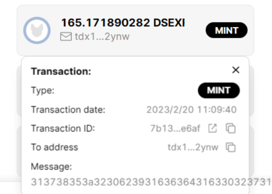

## 一句话说DeXian Stake Earning是什么？

DeXian Staking Earning是基于Radix的流动性质押协议，用户通过DeXian的服务，可以快速参与流动性质押（Liquid Staking），获得稳定收益，还可以快速赎回，立即获得你的XRD，无需等待Radix网络解锁时间周期, DeXian Staking Earning协议使用算法自动平衡不同Radix验证节点之间XRD质押数量，增加Radix网络去中心化性，增加网络的稳定性、健壮性。

## DeXian是谁，什么时候进入Radix生态，做了哪些事？

DeXian由KaiYuan Epoch Validator的技术团队开发，DeXian团队在2018年开始关注Radix项目，2021年初参与了早期的Betanet网络测试和Radix Olympia、Alexandria验证节点运营。团队还多次参与Radix Scrypto-Challenge开发者大赛，组织了Radix DeFi和Cerberus共识机制（A Parallelized BFT Consensus Protocol for Radix）等白皮书的中文翻译。

## Dexian Stake Earning协议的必要性是什么，它解决了什么问题？

它一站式地解决了快速Stake/Unstake的问题，尤其是提供了快速Unstake的服务，让用户无需再等待常规Radix Unstake约10~15天解锁期，提高了XRD的流动性，增加资金利用率，为用户提供了便利。

## Babylon智能合约上线前DSE(DeXian Stake Earning)是怎么运作的？

目前DSE采用中心化的方式运行，它是正式去中心化服务上线前(Babylon上线后会推出）的一个早期验证阶段产品。下面以实例说明：

1.  用户JOIN 180 XRD,[https://stokenet-explorer.radixdlt.com/#/transactions/4731637ffb30819ae967e775283085a649861b7a42560af4381632e2605190ae](https://stokenet-explorer.radixdlt.com/#/transactions/4731637ffb30819ae967e775283085a649861b7a42560af4381632e2605190ae), 此时的DSE单位净值是：1.09XRD/DSExrd(2023.2.20)

2. 用户会收到和180XRD等值约165DSExrd,[https://stokenet-explorer.radixdlt.com/#/transactions/7b13576b36fd158882d95e68fdfed6ee351cf5b676c8d9d2d1572c5245bee6af](https://stokenet-explorer.radixdlt.com/#/transactions/7b13576b36fd158882d95e68fdfed6ee351cf5b676c8d9d2d1572c5245bee6af)。 **DSExrd只有在发生JOIN时才会铸造**

3. 一定时间后用户想赎回50 DSExrd, 此时的净值是1.02 （2023.1.12）[https://stokenet-explorer.radixdlt.com/#/transactions/2d047be598e63fa263fd14427a1efae568cd0d1c9ef8110c06c14b2f4aaa307e](https://stokenet-explorer.radixdlt.com/#/transactions/2d047be598e63fa263fd14427a1efae568cd0d1c9ef8110c06c14b2f4aaa307e)

4. 用户会收到和50DSExrd等值的约51XRD，同时赎回的DSExrd会被销毁。（**快速赎回产生一定费用**) ，这是用户收款记录：[https://stokenet-explorer.radixdlt.com/#/transactions/d0e1a77a52de21ce80a61d265f785315ad31c9f06f5ab532d5e3c6d9dc7aba6b](https://stokenet-explorer.radixdlt.com/#/transactions/d0e1a77a52de21ce80a61d265f785315ad31c9f06f5ab532d5e3c6d9dc7aba6b) ,其销毁记录见：
[Burn](
https://stokenet-explorer.radixdlt.com/#/transactions/f0fa8ea84e9c18f719cdc23c5303fe2bdadd42333171c8b92c5a2d6fcb2a3814)

## DSE的收益是怎么产生的？快速赎回的费用如何？
DeXian Stake Earning背后的收益由Radix Staking产生的收益支撑，Staking产生的收益**全部**归DSExrd的持有者分享，也就是DSExrd的净值会随着用户持有DSExrd的时间增长持续稳定增加，同时DSExrd的收益率也会随着Staking收益率进行波动。

快速赎回的费用目前基本和10-15天的Staking所产生的收益相当。

## DSExrd 是否可以交易?
DSExrd可以转帐，交易，用户可以在DeXian推出的后续服务进行交易和使用，也可以在Ociswap等DEX上通过设立流动池（Liquid Pool）来进行交易。
