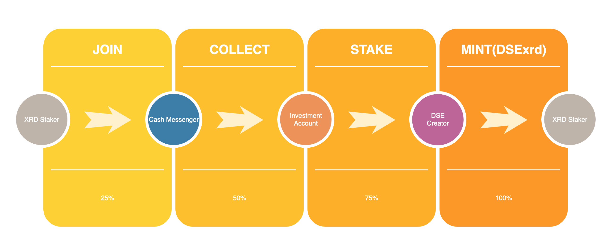

## What is DeXian Staking Earning?

DeXian Staking Earning (DSE) is a liquid staking protocol based on Radix, allowing users to fast **JOIN** the liquid staking, and earn stable proceeds through the DeXian service. Especially, users can **immediately REDEEM** their XRD invested without waiting for the Radix unstaking delay.

The DSE protocol will use algorithms to ensure that XRD staked by users will not be concentrated on a few validators, increasing the decentralization, stability and robustness of the Radix network.

## Who are we?

DeXian Stake Earning was developed by the technical team of KaiYuan Epoch Validator, which is currently a Radix Top 40 validator worldwide. The DeXian team has been following the Radix since 2018, participating in early Betanet network testing in 2021, and operating validators on Olympia and Alexandria. 

We also contributed to a series of Radix Scrypto-Challenges and translated white papers including Radix DeFi and Cerberus consensus (A Parallelized BFT Consensus Protocol for Radix) into Chinese, which played an important role in the promotion of Radix in the Chinese community.

## What exactly does DSE protocol solve?

DeXian provides a one-stop solution to the problem of **Fast stake** and even **Faster unstake**, providing users with convenience and increasing the liquidity of XRD. It allows users to eliminate waiting for the approximately 10 to 15 days unstaking delay of Radix, thus improving capital utilization.

## How does DSE work before Babylon smart contracts go live?

The DeXian Staking Earning currently operates in a centralized way and it is an **MVP** (Minimum Viable Product) before the decentralized service **DSE Beta** goes live.

The following are illustrative examples.

#### JOIN

1. Users **JOIN** 180 XRD, the net value of DSE units at this point is 1.09XRD/DSExrd (2023.2.20)
[https://stokenet-explorer.radixdlt.com/#/transactions/4731637ffb30819ae967e775283085a649861b7a42560af4381632e2605190ae](https://stokenet-explorer.radixdlt.com/#/transactions/4731637ffb30819ae967e775283085a649861b7a42560af4381632e2605190ae)

2. Users will receive approximately 165 DSExrd equivalent to 180XRD. **DSExrd will only mint when JOIN occurs.**  
[https://stokenet-explorer.radixdlt.com/#/transactions/7b13576b36fd158882d95e68fdfed6ee351cf5b676c8d9d2d1572c5245bee6af](https://stokenet-explorer.radixdlt.com/#/transactions/7b13576b36fd158882d95e68fdfed6ee351cf5b676c8d9d2d1572c5245bee6af)  

#### REDEEM

3. Users want to **REDEEM** 50 DSExrd after certain time, the net value at this point is 1.02 (2023.1.12).  
[https://stokenet-explorer.radixdlt.com/#/transactions/2d047be598e63fa263fd14427a1efae568cd0d1c9ef8110c06c14b2f4aaa307e](https://stokenet-explorer.radixdlt.com/#/transactions/2d047be598e63fa263fd14427a1efae568cd0d1c9ef8110c06c14b2f4aaa307e)

4. Users will receive approximately 51 XRD equivalent to 50 DSExrd, while the redeemed DSExrd will be **burned**. (**A fee will be charged for fast redemptions**)  
[https://stokenet-explorer.radixdlt.com/#/transactions/d0e1a77a52de21ce80a61d265f785315ad31c9f06f5ab532d5e3c6d9dc7aba6b](https://stokenet-explorer.radixdlt.com/#/transactions/d0e1a77a52de21ce80a61d265f785315ad31c9f06f5ab532d5e3c6d9dc7aba6b)  

Burn records：  
[https://stokenet-explorer.radixdlt.com/#/transactions/f0fa8ea84e9c18f719cdc23c5303fe2bdadd42333171c8b92c5a2d6fcb2a3814](
https://stokenet-explorer.radixdlt.com/#/transactions/f0fa8ea84e9c18f719cdc23c5303fe2bdadd42333171c8b92c5a2d6fcb2a3814)

## How does the DSE generate earnings?

DSE is supported by the earnings generated from staking return on Radix validators, and **ALL** of these earnings are shared by DSExrd holders. The net value of DSExrd will increase steadily as the user’s holding period gets longer, while the yield of DSExrd will fluctuate along with the Radix staking APY.

## What about the fee for fast redemption？

Currently, the fee charged for fast redemption is basically equal to the 10 to 15-day staking earnings.

## Is DSExrd available for trading?

DSExrd can transfer and trade. It can also be traded on DEX such as Ociswap by creating liquid pools.
